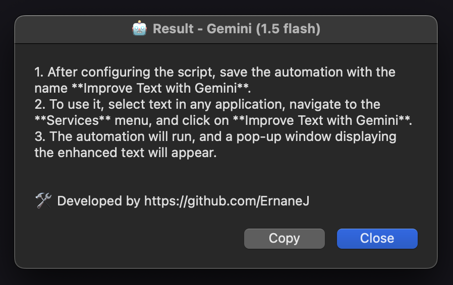

# ✨ Improve Text with Gemini

*AppleScript* that uses the Gemini language model API (by Google) to enhance the writing, spelling, and formality of selected text. The automation works directly on macOS, allowing you to select any text from applications and run the automation to improve it.

## 🛠️ Setup Instructions

### 1. Creating the Automation with Automator

1. Open **Automator** on macOS.
2. Choose the **"Workflow"** option.
3. In the field **"The workflow receives current:"**, select **"text"**, and in the field **"in:"**, select **"any application"**.
4. In the sidebar, under **Library**, search for and drag the **"Run AppleScript"** block into the workflow.
5. Copy the code from the [`service.applescript`](service.applescript) file in this repository and paste it into the **AppleScript** block in Automator.
6. **Modify the code** as needed:
    - **Prompt**: Change the `prompt` variable to adjust how the AI should respond (e.g., if you want to change the level of formality or add specific instructions).
    - **API Key**: Replace `"<YOUR-GEMINI-API-KEY-HERE>"` with your own Gemini API key.

### 2. Dependencies

The script uses the following tools to make the request and process the returned JSON:

- **curl**: Command-line tool for transferring data.
  - Version used: `curl 8.7.1 (x86_64-apple-darwin23.0)`
- **jq**: Command-line tool for processing JSON.
  - Version used: `jq-1.7.1`

#### Installing Dependencies

You can install both `curl` and `jq` via Homebrew:

```bash
brew install curl jq
```

### 3. Setting the `jq` Path

The script requires the exact path to the `jq` binary. To find the correct path, run the following command in the terminal:

```bash
which jq
```

Replace the `jq` path in the script, if necessary, with the one returned by the command. If installed via Homebrew, the path will typically be:

```bash
/opt/homebrew/bin/jq
```

### 4. Saving and Running the Automation

1. After configuring the script, save the automation with the name **"Improve Text With Gemini"**.
2. To use it, select text in any application, go to the **"Services"** menu, and click on **"Improve Text With Gemini"**.
3. The automation will run, and a popup with the enhanced text will appear.

## 🔍 Popup Example



## ✏️ Customization

You can customize the script's behavior by modifying the `prompt` variable to adjust how the Gemini language model processes the text:

```applescript
set prompt to "......."
```

And don’t forget to replace `<YOUR-GEMINI-API-KEY-HERE>` with your API key.

## 🚀 License

This project is **open-source** and was created by [ErnaneJ](https://github.com/ErnaneJ). Feel free to modify, improve, and share it.